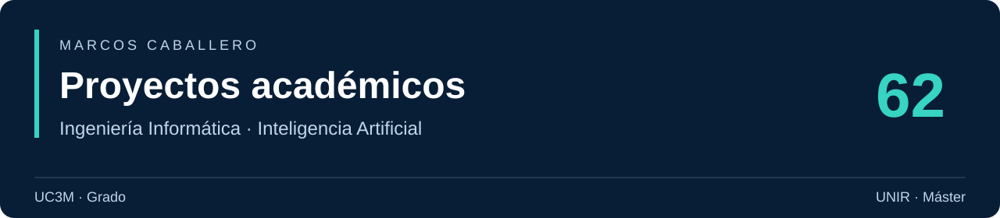

# Proyectos académicos

**Grado en Ingeniería Informática · UC3M**  
**Máster en Inteligencia Artificial · UNIR**

[Explorar la página](https://cabamarcos.github.io/academic-projects/) · [Mi perfil de GitHub](https://github.com/cabamarcos)

**61 entradas principales** · **27 asignaturas y TFG** · **2 titulaciones**

Una recopilación de mis prácticas, proyectos en equipo y trabajos de investigación: desde lógica digital, sistemas y desarrollo de software hasta aprendizaje automático, visión artificial y procesamiento del lenguaje natural.

Cada entrada enlaza al repositorio que contiene el código, los cuadernos y la documentación. Las descripciones resumen el contenido de los proyectos; las prácticas conservan su contexto académico y su fase de desarrollo. Los desarrollos personales posteriores se identifican expresamente.

> 🔒 Los repositorios privados aparecen identificados y requieren acceso en GitHub. El catálogo reúne sus referencias, sin publicar su código.

## Proyectos destacados

| Proyecto | Qué encontrarás | Tecnologías |
| --- | --- | --- |
| [Simulador de fluidos](https://github.com/cabamarcos/FluidSimulator) | Simulación de fluidos por partículas y bloques espaciales en C++20, con lectura de trazas, pruebas unitarias y pruebas funcionales. | C++20 · CMake · GoogleTest |
| [VideoFlix · vídeo accesible](https://github.com/cabamarcos/VideoFlix) | Plataforma de vídeos con mando remoto desde el móvil, funciones de voz, lectura fácil y pictogramas para facilitar la interacción. | JavaScript · Node.js · Socket.IO |
| [Experimentación con GANs](https://github.com/cabamarcos/GANs_experimentation) | Implementación y comparación de GANs densas, DCGAN, WGAN y WGAN-GP para generar imágenes de MNIST y CelebA. | Python · PyTorch · GANs |
| [SuperMask · trabajo de fin de grado](https://github.com/cabamarcos/SuperMask) | Investigación sobre algoritmos evolutivos para buscar supermáscaras en redes neuronales, con experimentos sobre MNIST, CIFAR-10 y Animals-10. | Python · PyTorch · algoritmos evolutivos |

## Índice

- [Grado en Ingeniería Informática · UC3M](#grado-uc3m)
  - [1.º curso](#uc3m-1) · [2.º curso](#uc3m-2) · [3.º curso](#uc3m-3) · [4.º curso y TFG](#uc3m-4)
- [Máster en Inteligencia Artificial · UNIR](#master-unir)
- [Repositorios alternativos y procedencia](#procedencia)
- [Pendiente de incorporar](#pendiente)
- [Cómo actualizar el catálogo](#actualizar)

## Grado en Ingeniería Informática · UC3M

**Universidad Carlos III de Madrid** · 45 entradas principales.

### 1.º curso

#### Estructura de computadores

| Proyecto | Descripción | Tecnologías |
| --- | --- | --- |
| [Lógica digital con VHDL](https://github.com/cabamarcos/Learning-VHDL) | Diseño y simulación de circuitos combinacionales y de un juego de piedra, papel o tijera para dos y cuatro jugadores. | VHDL · Quartus |

### 2.º curso

#### Desarrollo del software

| Proyecto | Descripción | Tecnologías |
| --- | --- | --- |
| [Gestión de vacunación · entrega inicial](https://github.com/cabamarcos/G89.2022.T01.EGZ) · 🔒 Privado | Primera entrega de un gestor de solicitudes de vacunación: validación de identificadores, datos personales y peticiones en JSON. | Python · JSON |
| [Gestión de vacunación · entrega 3](https://github.com/cabamarcos/G89.2022.T01.GE3) · 🔒 Privado | Registro de pacientes, generación de citas y administración de vacunas, con validación de datos y pruebas unitarias. | Python · PyBuilder · unittest |
| [Gestión de vacunación · entrega 4](https://github.com/cabamarcos/G89.2022.T01.GE4) · 🔒 Privado | Evolución del gestor de vacunación con atributos de dominio, excepciones y pruebas de validación de entradas JSON. | Python · PyBuilder · unittest |
| [Gestión de vacunación · proyecto final](https://github.com/cabamarcos/G89.2022.T01.FP) | Proyecto final del gestor de vacunación: organización del dominio, persistencia JSON, cancelación de citas y pruebas automatizadas. | Python · PyBuilder · unittest |

#### Inteligencia artificial

| Proyecto | Descripción | Tecnologías |
| --- | --- | --- |
| [Control inteligente de semáforos](https://github.com/cabamarcos/ArtificialInteligence) | Estimación de probabilidades de transición y búsqueda de una política para un cruce de tráfico mediante un proceso de decisión de Markov. | Python · MDP |

#### Sistemas operativos

| Proyecto | Descripción | Tecnologías |
| --- | --- | --- |
| [Utilidades de archivos en C](https://github.com/cabamarcos/P1_Operating_Systems) | Implementación de versiones de cat, ls y cálculo de tamaños para practicar llamadas al sistema y operaciones sobre archivos y directorios. | C · POSIX |
| [Intérprete de comandos](https://github.com/cabamarcos/MiniShell) | Mini shell con ejecución de procesos, tuberías, redirecciones, señales y comandos internos. | C · POSIX · procesos |
| [Cálculo concurrente de costes](https://github.com/cabamarcos/CostCalculatorMultiThread) | Procesamiento de operaciones con productores y consumidores, una cola compartida e hilos POSIX para calcular costes. | C · pthreads · concurrencia |

#### Ficheros y bases de datos

| Proyecto | Descripción | Tecnologías |
| --- | --- | --- |
| [Modelo relacional sanitario](https://github.com/cabamarcos/DataBases_1) | Creación y carga de un esquema de médicos, hospitales, aseguradoras y pólizas, con claves, restricciones y transformación de datos. | SQL · Oracle |
| [Consultas sobre servicios sanitarios](https://github.com/cabamarcos/Databases_2) | Consultas complejas sobre el esquema sanitario de la primera práctica: coberturas, especialidades, médicos y periodos de carencia. | SQL · Oracle |

#### Estructuras de computadores

| Proyecto | Descripción | Tecnologías |
| --- | --- | --- |
| [Programación en MIPS32](https://github.com/cabamarcos/Learning-Assembly) | Ejercicios de ensamblador sobre vectores, matrices, llamadas a funciones y uso de la pila, con una versión de referencia en Python. | MIPS32 · ensamblador |

### 3.º curso

#### Arquitectura de computadores

| Proyecto | Descripción | Tecnologías |
| --- | --- | --- |
| [Cliente SOAP de temperaturas](https://github.com/cabamarcos/Web-service-example) | Consumo de un servicio web de conversión entre Celsius y Fahrenheit mediante un cliente SOAP escrito en Python. | Python · SOAP · Zeep |
| [C++ orientado al rendimiento](https://github.com/cabamarcos/Arq_g81_E05) · 🔒 Privado | Material inicial de una práctica de programación en C++ orientada al rendimiento y al manejo de archivos. **Desarrollo inicial; parte del material está incompleta.** | C++ · CMake |
| [Simulador de fluidos](https://github.com/cabamarcos/FluidSimulator) | Simulación de fluidos por partículas y bloques espaciales en C++20, con lectura de trazas, pruebas unitarias y pruebas funcionales. | C++20 · CMake · GoogleTest |

#### Interfaces de usuario

| Proyecto | Descripción | Tecnologías |
| --- | --- | --- |
| [Prototipo de reproductor musical](https://github.com/cabamarcos/WebPage) · 🔒 Privado | Primera interfaz web de música con reproducción, registro y páginas de cuenta y perfil. | HTML · CSS · JavaScript |
| [Musify · aplicación musical](https://github.com/cabamarcos/Musify) · 🔒 Privado | Interfaz de música con biblioteca, listas de reproducción, favoritos, búsqueda, perfiles y controles del reproductor. | HTML · CSS · JavaScript |

#### Heurística

| Proyecto | Descripción | Tecnologías |
| --- | --- | --- |
| [Optimización de transporte escolar](https://github.com/cabamarcos/Heuristica_P1) · 🔒 Privado | Modelos de programación matemática para minimizar costes de rutas de autobús y asignar alumnos a paradas bajo restricciones de capacidad y parentesco. | GNU MathProg · optimización |
| [Transporte escolar con CSP y A*](https://github.com/cabamarcos/Heuristica_P2) · 🔒 Privado | Resolución de la distribución de alumnos con satisfacción de restricciones y planificación mediante búsqueda A*, con casos de prueba y estadísticas. | Python · CSP · A* |

#### Criptografía y seguridad informática

| Proyecto | Descripción | Tecnologías |
| --- | --- | --- |
| [Registro de vehículos con criptografía](https://github.com/cabamarcos/SecureApp) | Aplicación de escritorio para registrar y consultar datos de vehículos con autenticación, cifrado Fernet, derivación de claves y claves RSA. | Python · Tkinter · SQLite · cryptography |

#### Aprendizaje automático

| Proyecto | Descripción | Tecnologías |
| --- | --- | --- |
| [Predicción de producción solar](https://github.com/cabamarcos/Machine-Learning-Prediccion-de-produccion-electrica-solar) | Comparación de modelos de regresión y ajuste de hiperparámetros para estimar producción solar a partir de predicciones meteorológicas. | Python · scikit-learn · Jupyter |
| [Predicción de abandono de empleados](https://github.com/cabamarcos/Machine-Learning-prediccion-abandono-burnout-empleados) | Clasificación de abandono laboral con preprocesamiento, regresión logística, boosting y evaluación de datos desbalanceados. | Python · scikit-learn · XGBoost |
| [Pacman · aprendizaje por refuerzo](https://github.com/cabamarcos/Pacman) · 🔒 Privado | Q-learning para capturar fantasmas visibles y estáticos, con entrenamiento reproducible, comparación frente a agentes aleatorios y BFS, y una demo de trayectorias. **Material previsto para Aprendizaje Automático de 3.º que no llegó a formar parte de los proyectos de ese curso escolar. Desarrollo personal posterior (2026).** | Python · Q-learning · BFS |

#### Sistemas interactivos y ubicuos

| Proyecto | Descripción | Tecnologías |
| --- | --- | --- |
| [Avisos de proximidad](https://github.com/cabamarcos/Navigator) | Aplicación web que usa geolocalización y vibración para avisar cuando el usuario se acerca a su destino. | JavaScript · Geolocation API |
| [Lista de tareas táctil](https://github.com/cabamarcos/To-do-list) | Interfaz móvil para añadir y gestionar tareas, con interacciones táctiles y un servidor de apoyo en Node.js. | JavaScript · Node.js · HTML |
| [Reproductor con gestos táctiles](https://github.com/cabamarcos/TouchAPI) | Control de vídeo mediante toques, dobles toques y deslizamientos para reproducir, avanzar, ajustar el volumen y activar pantalla completa. | JavaScript · Touch API · Fullscreen API |
| [Reconocimiento y síntesis de voz](https://github.com/cabamarcos/SpeechRecognition) | Demostración web que transcribe voz y reproduce texto mediante las funciones de reconocimiento y síntesis de voz del navegador. | JavaScript · Web Speech API |
| [VideoFlix · vídeo accesible](https://github.com/cabamarcos/VideoFlix) | Plataforma de vídeos con mando remoto desde el móvil, funciones de voz, lectura fácil y pictogramas para facilitar la interacción. | JavaScript · Node.js · Socket.IO |

#### Procesadores del lenguaje

| Proyecto | Descripción | Tecnologías |
| --- | --- | --- |
| [Analizadores y traductores](https://github.com/cabamarcos/procesadores_lenguaje) · 🔒 Privado | Prácticas de análisis sintáctico descendente y calculadoras en C, junto con el desarrollo del traductor de C a Lisp. | C · Bison · análisis sintáctico |
| [Traductor de C a Lisp](https://github.com/cabamarcos/CtoLisp) | Traducción de un subconjunto de C a Lisp mediante gramáticas Bison, con pruebas de funciones, bucles y expresiones. | C · Bison · Lisp |

#### Sistemas distribuidos

| Proyecto | Descripción | Tecnologías |
| --- | --- | --- |
| [Servicio clave-valor con colas POSIX](https://github.com/cabamarcos/Ejercicio2_distribuidos) · 🔒 Privado | Servicio cliente-servidor de almacenamiento clave-valor en C, comunicado mediante colas de mensajes POSIX. **Versión conservada; pendiente de sustituir por la entrega más completa.** | C · POSIX · IPC |
| [Servicio clave-valor con RPC](https://github.com/cabamarcos/Ejercicio3-distribuidos) · 🔒 Privado | Evolución del servicio clave-valor con interfaces RPC, código generado a partir de una especificación y comunicación cliente-servidor. **Versión conservada; pendiente de sustituir por la entrega más completa.** | C · RPC · rpcgen |
| [Aplicación distribuida cliente-servidor](https://github.com/cabamarcos/Practica-final-distribuidos) · 🔒 Privado | Proyecto distribuido con servidor en C, cliente gráfico en Python, comunicación por sockets y un servicio web complementario. **Versión conservada; pendiente de sustituir por la entrega más completa.** | C · Python · sockets |

### 4.º curso y trabajo de fin de grado

#### Ingeniería de la ciberseguridad

| Proyecto | Descripción | Tecnologías |
| --- | --- | --- |
| [Evaluación de resistencia de contraseñas](https://github.com/cabamarcos/Password-Cracking) | Experimentos académicos con John the Ripper para comparar ataques de diccionario y fuerza bruta sobre hashes MD5 y SHA-256. | John the Ripper · Bash · Python |

#### Inteligencia artificial en las organizaciones

| Proyecto | Descripción | Tecnologías |
| --- | --- | --- |
| [Reconocimiento de caracteres en CAPTCHA](https://github.com/cabamarcos/Captcha_recognition) | Generación de imágenes CAPTCHA y experimentación con redes convolucionales para reconocer sus caracteres. | Python · TensorFlow · Keras · OpenCV |

#### Redes de neuronas

| Proyecto | Descripción | Tecnologías |
| --- | --- | --- |
| [Predicción del rendimiento de turbinas · práctica 1](https://github.com/cabamarcos/Gas-Turbine-Emission-Prediction) | Predicción del rendimiento energético (TEY) de una turbina de gas a partir de sensores, comparando Adaline implementada desde cero y un perceptrón multicapa. | Python · NumPy · TensorFlow · Keras |
| [Clasificación de medios de transporte](https://github.com/cabamarcos/P2.1-RRNN) · 🔒 Privado | Redes neuronales densas para identificar el medio de transporte a partir de datos de sensores, con preprocesamiento y tratamiento del desbalanceo. | Python · TensorFlow · Keras |
| [Clasificación de imágenes aéreas](https://github.com/cabamarcos/P2.2-RRNN) · 🔒 Privado | Redes neuronales para clasificar escenas de uso del suelo del conjunto UC Merced, con preparación de imágenes y experimentación convolucional. | Python · TensorFlow · Keras |

#### Desarrollo y operación de sistemas software

| Proyecto | Descripción | Tecnologías |
| --- | --- | --- |
| [Aplicación de películas con CI](https://github.com/cabamarcos/DevOps) · 🔒 Privado | Aplicación Python de gestión de películas con SQLite, modelos de dominio, pruebas automatizadas y un flujo de integración y calidad en GitHub Actions. | Python · SQLite · GitHub Actions |

#### Internet de las cosas

| Proyecto | Descripción | Tecnologías |
| --- | --- | --- |
| [Prototipo de vehículo con Raspberry Pi](https://github.com/cabamarcos/VehiclePrototype) · 🔒 Privado | Prácticas con un vehículo físico en Raspberry Pi: sensores de distancia y luz, motor DC, servomotor y luces RGB, con interrupciones, hilos y ejecución de comandos. | Python · Raspberry Pi · GPIO · threading |
| [Gemelo digital de vehículos](https://github.com/cabamarcos/DigitalTwinVehiclePrototype) | Prototipo IoT que conecta vehículos virtuales, telemetría y gestión de rutas mediante MQTT, microservicios y contenedores. | Python · MQTT · Docker · Flask |
| [Tacógrafo virtual](https://github.com/cabamarcos/Virtual-Tachograph) | Sistema IoT para gestionar tacógrafos, sesiones de conducción, telemetría y eventos mediante MQTT y microservicios. | Python · MQTT · Docker · Flask |

#### Visión artificial

| Proyecto | Descripción | Tecnologías |
| --- | --- | --- |
| [Clasificación de lesiones cutáneas](https://github.com/cabamarcos/Skin_cancer_classifier) | Experimento de clasificación de imágenes dermatoscópicas ISIC con redes convolucionales, preprocesamiento y aumento de datos en PyTorch. | Python · PyTorch · CNN |
| [Experimentación con GANs](https://github.com/cabamarcos/GANs_experimentation) | Implementación y comparación de GANs densas, DCGAN, WGAN y WGAN-GP para generar imágenes de MNIST y CelebA. | Python · PyTorch · GANs |

#### Trabajo de fin de grado

| Proyecto | Descripción | Tecnologías |
| --- | --- | --- |
| [SuperMask · trabajo de fin de grado](https://github.com/cabamarcos/SuperMask) | Investigación sobre algoritmos evolutivos para buscar supermáscaras en redes neuronales, con experimentos sobre MNIST, CIFAR-10 y Animals-10. | Python · PyTorch · algoritmos evolutivos |

## Máster en Inteligencia Artificial · UNIR

**Universidad Internacional de La Rioja** · 16 entradas principales.

### Procesamiento del lenguaje natural

| Proyecto | Descripción | Tecnologías |
| --- | --- | --- |
| [Caracterización de textos de odio](https://github.com/cabamarcos/Caracterizacion_de_textos) | Análisis y preprocesamiento lingüístico de comentarios en español con spaCy, tokenización y reconocimiento de entidades. | Python · spaCy · NLP |
| [Clasificación con embeddings y Transformers](https://github.com/cabamarcos/WordEmbeddings-Transformers) | Clasificación de mensajes de 20 Newsgroups mediante vocabularios, embeddings y comparación de redes clásicas con un modelo Transformer. | Python · TensorFlow · Keras · Transformers |

### Aprendizaje automático supervisado

| Proyecto | Descripción | Tecnologías |
| --- | --- | --- |
| [Predicción de calidad del aire](https://github.com/cabamarcos/AirQualityPrediction) | Regresión sobre el conjunto Air Quality de UCI, con limpieza de datos y comparación de regresión lineal y árboles de decisión. | Python · scikit-learn · regresión |
| [Clasificación de mensajes de odio](https://github.com/cabamarcos/HateSpeachRecognition) | Preparación de textos y comparación de modelos supervisados para clasificar mensajes de odio, con evaluación mediante precisión, recall y F1. | Python · scikit-learn · NLP |
| [Predicción de cubierta forestal](https://github.com/cabamarcos/ForestCoverPrediction) | Clasificación del conjunto Covertype de UCI a partir de variables cartográficas, comparando máquinas de vectores de soporte y Random Forest. | Python · scikit-learn · SVM · Random Forest |

### Aprendizaje automático no supervisado

| Proyecto | Descripción | Tecnologías |
| --- | --- | --- |
| [Comparación de clustering](https://github.com/cabamarcos/clustering-algorithms-comparison) | Análisis de datos de sensores de maquinaria mediante K-means, clustering jerárquico y DBSCAN, con evaluación de los grupos obtenidos. | Python · scikit-learn · clustering |
| [Reducción de dimensionalidad](https://github.com/cabamarcos/dimensionality-reduction-analysis) | Comparación de PCA y t-SNE para visualizar datos de texto en dos dimensiones, con exploración de temas mediante LDA. | Python · scikit-learn · Gensim · PCA |
| [Detección de anomalías eléctricas](https://github.com/cabamarcos/Outlier_detection) | Detección de valores inusuales en datos de corriente y tensión mediante media móvil, Z-score, Isolation Forest y Local Outlier Factor. | Python · scikit-learn · anomalías |

### Razonamiento y planificación automática

| Proyecto | Descripción | Tecnologías |
| --- | --- | --- |
| [Comparación de algoritmos de búsqueda](https://github.com/cabamarcos/Search_algorithms) | Resolución de recorridos en mapas con búsqueda en amplitud, profundidad, coste uniforme y A*, comparando costes y heurísticas. | Python · SimpleAI · A* |
| [Dominios de planificación en PDDL](https://github.com/cabamarcos/PDDL) · 🔒 Privado | Modelado de dominios y problemas de planificación: mundo de bloques, contador, rovers y transporte. | PDDL · planificación |
| [Planificación de misiones de rovers](https://github.com/cabamarcos/PyPA_2) · 🔒 Privado | Modelado de problemas de exploración con rovers en PDDL y variantes de objetivos para planificadores automáticos. | PDDL · rovers |

### Visión artificial

| Proyecto | Descripción | Tecnologías |
| --- | --- | --- |
| [Mejora de imágenes con poca luz](https://github.com/cabamarcos/Mejora_de_imagenes) | Experimentos sobre Dark Face con ajustes de brillo, ecualización de histogramas, CLAHE y corrección gamma. | Python · OpenCV · Jupyter |
| [Detección de tomates maduros](https://github.com/cabamarcos/TomatoDetection) | Segmentación por color HSV, filtros espaciales, morfología y análisis de contornos para detectar tomates maduros. | Python · OpenCV · visión artificial |

### Redes de neuronas

| Proyecto | Descripción | Tecnologías |
| --- | --- | --- |
| [Dígitos manuscritos con MLP](https://github.com/cabamarcos/MNIST_MLP) | Clasificación de dígitos de MNIST mediante perceptrones multicapa y experimentación con el entrenamiento en Keras y TensorFlow. | Python · TensorFlow · Keras |
| [Clasificación de CIFAR-10](https://github.com/cabamarcos/CIFAR10_CNN) | Clasificación de imágenes de animales y vehículos con redes convolucionales y experimentación con modelos en Keras. | Python · TensorFlow · Keras · CNN |
| [Intensidad de odio con redes recurrentes](https://github.com/cabamarcos/LSTM_hate_recognition) | Clasificación de la intensidad de odio en mensajes de redes sociales mediante preprocesamiento textual y redes recurrentes LSTM. | Python · TensorFlow · Keras · LSTM |

## Repositorios alternativos y procedencia

El índice usa una sola entrada para cada uno de los dos proyectos que tenían una copia pública y un fork privado. Los originales se conservan como referencia del trabajo en equipo.

| Entrada principal | Repositorio original | Motivo de la elección |
| --- | --- | --- |
| [FluidSimulator](https://github.com/cabamarcos/FluidSimulator) | [Proyecto_arqui](https://github.com/cabamarcos/Proyecto_arqui) · 🔒 Privado | Los 22 archivos de la copia pública coinciden con el fork. El original conserva también configuración de estilo y análisis estático. |
| [VideoFlix](https://github.com/cabamarcos/VideoFlix) | [P2_ubicuos](https://github.com/cabamarcos/P2_ubicuos) · 🔒 Privado | Versión pública posterior, con ajustes en la interfaz y el servidor; el fork conserva el desarrollo de equipo. |

[procesadores_lenguaje](https://github.com/cabamarcos/procesadores_lenguaje) reúne las prácticas de analizadores y el desarrollo del traductor; [CtoLisp](https://github.com/cabamarcos/CtoLisp) presenta por separado el proyecto final. Ambos tienen su propia entrada.

Las autorías, licencias y créditos se consultan en cada repositorio original.

## Pendiente de incorporar

| Titulación | Asignatura o trabajo | Próxima actualización |
| --- | --- | --- |
| UC3M | Sistemas distribuidos | Incorporar las versiones más completas conservadas en otro ordenador. |
| UC3M | Ingeniería de la ciberseguridad | Añadir las prácticas que aún no están recopiladas. |
| UC3M | Inteligencia artificial en las organizaciones | Completar las entregas anteriores al proyecto final. |
| UNIR | Trabajo de fin de máster | Añadir el TFM cuando esté localizado. |

## Cómo actualizar el catálogo

El contenido del README y de la página nace de una única fuente: [`data/projects.json`](data/projects.json). Para añadir una entrega, cambiar su enlace o incorporar el TFM:

1. Editar los datos del proyecto en ese archivo.
2. Ejecutar `python scripts/generate.py`.
3. Revisar y subir los cambios; GitHub Pages publica el contenido de `docs/`.

El generador solo necesita Python 3 y su biblioteca estándar. La página es estática y no requiere instalar dependencias.

---

**Marcos Caballero Cortés** · [@cabamarcos](https://github.com/cabamarcos)  
Última revisión del catálogo: **1 de octubre de 2026**.
